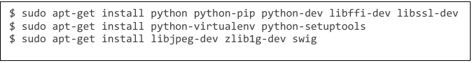
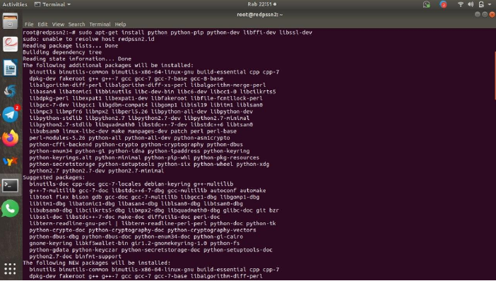
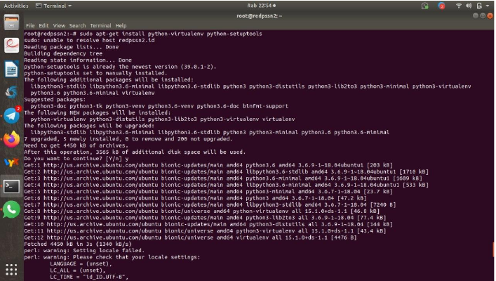
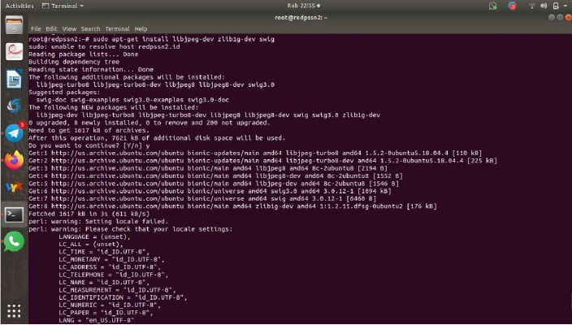

Instalasi Cuckoo
================

contact: fernando@gmail.com

1 Requirements

Sebelum melakukan instalasi dan melakukan konfiguasi pada Cuckoo, ada beberapa software dan libraries yang dibutuhkan

    a. Installing Python libraries (on Ubuntu/Debian-based distributions)
       Komponen host Cuckoo sepenuhnya ditulis dalam Python, oleh karena itu diperlukan untuk menginstal versi Python yang sesuai.

       Lakukan install pada software berikut agar Cuckoo dapat berjalan dengan sempurna :
       

Untuk dapat menggunakan Web-interface berbasis Django, MongoDB akan
dieprlukan, jalankan command berikut :

