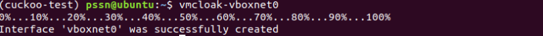

Instalasi
=========

contact: fernando@gmail.com

Requirements
^^^^^^^^^^^^

Sebelum melakukan instalasi dan melakukan konfiguasi pada Cuckoo, ada beberapa software dan libraries yang dibutuhkan

A. Instalasi Python libraries (on Ubuntu/Debian-based distributions)
Komponen host Cuckoo sepenuhnya ditulis dalam Python, oleh karena itu diperlukan untuk menginstal versi Python yang sesuai.

Lakukan install pada software berikut agar Cuckoo dapat berjalan dengan sempurna :
       
.. image:: gambar1.png

Untuk dapat menggunakan Web-interface berbasis Django, MongoDB akan
dieprlukan, jalankan command berikut :

.. image:: gambar5.png
.. image:: mongodb.png

Selanjutnya pada pembangunan Cuckoo, digunakan databse PostgreSQL. Lakukan instalasi PostgreSQL dengan perintah: 

$ sudo apt-get install postgresql libpq-dev

B. Virtualization Software

Melakukan instalasi VirtualBox dari repositori VirtualBox untuk mendapatkan versi virtualbx rilisan terbaru. Pentingnya melakukan hal tersebut untuk meningkatkan keamanan pada lapisan virtualisasi. menjalankan command berikut :
    
$ wget -q https://www.virtualbox.org/download/oracle_vbox.asc -O- | sudo apt- key add -
    

Kemudian tambahkan repositori VirtualBox dengan menjalankan perintah berikut:

$ sudo add-apt-repository "deb [arch=amd64] http://download.virtualbox.org/virtualbox/debian bionic contrib"

Setelah kebutuhan awal virtualbox terpenuhi, langkah selanjutnya adalah dengan melakukan melakukan instalasi virtualbox namun pada Cuckoo Malware Analysisis ini hanya dapat mendukung virtualbox dengan versi 5,2. lakukan instalasi menggunakan perintah berikut :

$ sudo apt-get install virtualbox-5.2

C. Instalasi TCPDump

Untuk membuang aktivitas jaringan yang dilakukan oleh malware selama eksekusi berlangsung, diperlukan sniffer jaringan dengan konfigurasi yang benar untuk melakukan tangkapan log lalu lintas. Secara default Cuckoo menggunakan tcpdump dalam melakukan sniffer jaringan. Lakukan instalasi tcpdump dengan menggunakan perintah berikut:

$ sudo apt-get install tcpdump apparmor-utils

Karena tcpdump memerlukan hak akses root, Maka lakukan konfigurasi tcpdump dengan menggunakan perintah berikut agar tcpdump dapat berjalan :

$ sudo groupadd pcap

$ sudo usermod -a -G pcap cuckoo

$ sudo chgrp pcap /usr/sbin/tcpdump

$ sudo setcap cap_net_raw,cap_net_admin=eip /usr/sbin/tcpdump

Untuk memverifikasi konfigurasi dan instalasi tcpdump, lakukan pengecekan dengan perintah “getcap /usr/sbin/tcpdump”. Apabila konfigurasi berhasil maka akan menampilkan seperti berikut :

$ getcap /usr/sbin/tcpdump

Selanjutnya adalah dengan melakukan konfigurasi AppArmor (aa),  Hal ini bertujuan agar AppArmor tidak menolak pembuatan file pcap. Konfigurasi AppArmor dapat dilakukan dengan perintah:

$ sudo aa-disable /usr/sbin/tcpdump

D. Instalasi M2Crypto

Langkah selanjutnya dalam mempersiapkan Cuckoo malware analysis adalah dengan dapat menginstal M2Crypto  menggunakan perintah sebagai berikut:

$ sudo pip install m2crypto

Cuckoo Installation
^^^^^^^^^^^^^^^^^^^
Setelah tahap instalasi awal, barulah Cukoo dapat dipasang pada server yang akan digunakan untuk melakukan analisis malware.

A. Create user
Cuckoo dapat dijalankan melalui host OS sendiri atau membuat environment baru pada Virtual Machine. Karena Cuckoo yang akan di install menggunakan Virtualbox, masukan pengguna ke dalam grup vboxuser, agar dapat mengakses VirtualBox, dengan menjalankan perintah:

$ sudo usermod -a -G vboxusers pssn

B. Cuckoo Installation

1. Lakukan Setup Virtualenv dengan melakukan pembaruan dan lakukan instalasi virtualenv, dengan menggunakan perintah :

$ sudo apt-get update && sudo apt-get -y install virtualenv

2. Selanjutnya, tambahkan VirtualenvWrapper pada server dengan menjalan perintah berikut :

$ sudo apt-get -y install virtualenvwrapper

kemudian jalankan perintah echo berikut untuk digunakan menampilkan pesan dan hasil.

$ echo "source /usr/share/virtualenvwrapper/virtualenvwrapper.sh" >> ~/.bashrc

$ source ~/.bashrc

3. Selanjutnya melakukan instalasi pip untuk python3 dengan menjalankan perintah :

$ sudo apt-get -y install python3-pip

4. Mengaktifkan otomatisasi bash untuk pip dengan perintah:
$ pip3 completion --bash >> ~/.bashrc

5. Menghindari intstalasi menggunakan root, dengan perintah:
$ pip3 install --user virtualenvwrapper

$ echo "export VIRTUALENVWRAPPER_PYTHON=/usr/bin/python3" >> ~/.bashrc

$ export WORKON_HOME=~/.virtualenvs

$ echo "export WORKON_HOME=~/.virtualenvs" >> ~/.bashrc
	
$ echo "export PIP_VIRTUALENV_BASE=~/.virtualenvs" >> ~/.bashrc

$ source ~/.bashrc

6. Membuat Virtualenv dengan perintah:

$ virtualenv -p python2.7 cuckoo-test

.. image:: gambar24.png

7. Melakukan Setup pip, langkah pertama dengan masuk kedalam Virtualenv dan lakukan istalasi pip untuk setup pip.

$ . cuckoo-test/bin/activate
(venv)$ pip install -U pip setuptools
(venv)$ pip install -U cuckoo

8. Lakukan Download dan Mount iso untuk Cuckoo, dengan menggunakan perintah berikut :

$ wget https://cuckoo.sh/win7ultimate.iso

9. Membuat Direktori dan lakukan mount pada iso, dengan menggunakan perintah berikut :

$ mkdir /mnt/win7

$ sudo mount -o ro,loop win7ultimate.iso /mnt/win7

VMCloak Installation
^^^^^^^^^^^^^^^^^^^^
Pada tahap ini akan melakukan instalasi beberapa paket sebelum melakukan instalasi Cuckoo dan VMCloak, agar depedensi yang dibutuhkan terpenuhi, sehingga dapat berjalan dengan sesuai.

1. Lakukan instalasi paket Cuckoo dan VMCloak dengan perintah:

$ sudo apt-get -y install build-essential libssl-dev libffi-dev python-dev genisoimage

$ sudo apt-get -y install zlib1g-dev libjpeg-dev

$ sudo apt-get -y install python-pip python-virtualenv python-setuptools swig

2. Langkah selanjutnya adalah melakukan instalasi Cuckoo Sandbox dan VMCloak pada virtualenv yang telah disiapkan dengan menjalankan perintah berikut :

(venv)$ pip install -U cuckoo vmcloak

Automatic CM Creation
^^^^^^^^^^^^^^^^^^^^^
Pada tahap ini akan dilakukan instalasi windows secara manual, meginstal software yang dibutuhkan, serta melakukan modifikasi lainnya. Untuk membuat VM secara otomatis, lakukan langkah sebagai berikut;

1. Menentukan dan membuat jaringan Host-Only VirtualBox untuk digunakan oleh Virtual Machine, dengan perintah:

$ Vmcloak-vboxnet0

2. Gunakan ISO yang telah install sebelumnya untuk mengatur virtual machine Windows. VMCloak akan mencoba untuk menginstall win7x64 secara default.Oleh karena itu proses ini akan membutuhkan memory RAM sebesar 2GB dan 2 CPU. Untuk melakukan instalasi virtual machine Windows, dapat dilakukan dengan perintah:

$ vmcloak init --verbose --win7x64 win7x64base --cpus 2 --ramsize 2048

3. Lakukan cloning pada virtual machine Windows. Sehingga kita dapat melakukan instalasi software dan snapshot pada clone. Karena Ketika image telah dilakukan snapshot, maka image tersebut tidak dapat diubah lagi.

$ vmcloak clone win7x64base win7x64cuckoo

4. Mulai dari sini kita menggunakan image/Vi==virtual machine clone Windows yang telah dilakukan pada langkah sebelumnya. Lakukan instalasi internet explorer 11 pada virtual machine.

$vmcloak install win7x64cuckoo ie11

5. Setelah melakukan instalasi software, lakukan snapshot. Ketika kita melakukan snapshot, virtual machine yang di snapshot tidak dapat diubah lagi. Pada langkah ini kita akan membuat 4 buah snapshot.

$vmcloak snapshot --count 4 win7x64cuckoo 192.168.56.101

.. image:: gambar36.png

6. ntuk memverifikasi snapshot yang telah dilakukan pada langkah sebelumnya. Lakukan perintah:

$vmcloak list vms

Cuckoo Configuration
^^^^^^^^^^^^^^^^^^^^

Cuckoo memiliki konfigurasi file, signature, dan file-file yang dapat diubah oleh penggunanya. Yang berada di Cuckoo Working Directory (CWD). Secara default file tersebut berada pada $USERHOME/.cuckoo. 

1. Sebelum menggunakan cuckoo, buatlah direktori cuckoo dengan perintah:

$cuckoo init

.. image:: gambar38.png

2. Lakukan verifikasi direktori cuckoo telah tersedia pada virtual machine dengan perintah:

$cd .cuckoo/
$ls

3. Lakukan updating signature pada cuckoo untuk mempermudah dalam analisis sample yang terbaru.

$cuckoo community

4. Untuk mempermudah pengguna dalam me-monitor lakulan perubahan mode pada virtualbox.conf menjadi gui.

$virtualbox.conf

5. Untuk mempermudah menambah virtual machine ke cuckoo dan melakukan konfigurasi agar terhindari dari kesalahan dalam konfigurasi. Lakukan perintah dibawah ini untuk melakukan penambahan virtual machine dan konfigurasi pada cuckoo.

$while read -r vm ip; do cuckoo machine --add $vm $ip; done < <(vmcloak list vms)

Untuk memverifikasi penambahan  dan konfigurasi pada cuckoo. Kita dapat melihat pada virtualbox.conf, terdapat 4 buah virtual machine (berasal dari snapshot yang telah dilakukan) pada cuckoo.

$nano virtualbox.conf

6. Lakukan konfigurasi network untuk memberikan virtual machine koneksi internet. Internet dibutuhkan untuk meningkatkan analisi dengan mengambil payloads dan instruction dari internet. Dengan melakukan traffic forwarding untuk memberikan kases internet ke virtual machine.

$sudo sysctl -w net.ipv4.conf.vboxnet0.forwarding=1

$sudo sysctl -w net.ipv4.conf.ens33.forwarding=1

7. Lakukan konfigurasi routing. Cuckoo akan menggunakan rrouting secara default (routing = none) dengan menggunakan outgoing interface adalah ens33 (internet=ens33)

$sudo nano routing.conf

8. Cuckoo menggunakan cuckoo rooter. Proses ini berjalan terpisah dengan kewenangan yang dimiliki user root. Cuckoo rooter dapat mengeksekusi ­pre-defined command. Gunakan cuckoo rooter untuk membuat UNIX socket yang dimiliki root dan mengizinkan grup “pssn” untuk menggunakannya.

$cuckoo rooter --sudo --group pssn

9. Lakukan konfigurasi reporting agar kita dapat menggunakan MongoDB sebagai cuckoo web interface. Web interface dapat digunakan untuk submit new tasks dan melihat analisis. Pada reporting.conf, lakukan enable pada baris MongoDB.

$ sudo nano reporting.conf

10. Setelah seluruh langkah telah selesai, kita dapat mengakses cuckoo dengan perintah:

$cuckoo web --host 127.0.0.1 --port 8080

    

