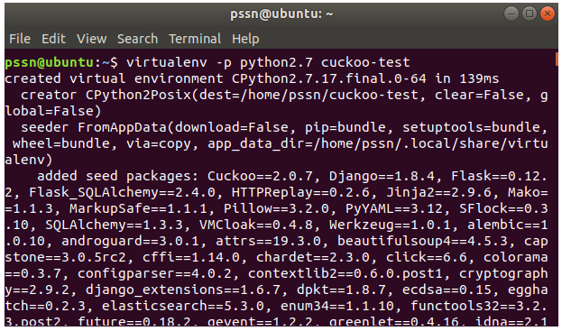

Penggunaan Cuckoo
=================

Menajalankan Cuckoo
^^^^^^^^^^^^^^^^^^^

Untuk penggunaa cuckoo, jalankan cuckoo, rooter, dan web interface cuckoo pada terminal yang berbeda.

1. Pada terminal 1, dilakukan untuk menjalankan perintah agar rooter dapat digunakan oleh group PSSN. 

$ cuckoo rooter –sudo –group pssn

2. Selanjutnya, Pada terminal 2, jalankan virtual environment yang telah dibuat pada langkah sebelumnya. 

$virtualenv -p python2.7 cuckoo-test

3. Pada terminal 3, jalankan web interface cuckoo untuk mempermudah dalam melihat analisis dan memonitor  cuckoo.

$cuckoo web –host 0.0.0.0 –port 8000

4. Setelah semua terminal telah dijalankan, berikut merupakan tampilan pada ketiga terminal dalam menjalankan cuckoo.

Cuckoo Interface
^^^^^^^^^^^^^^^^
Setelah menjalankan ketiga perintah diatas, buka engine browser dan akses alamat IP cuckoo dengan port yang telah di konfigurasikan.

Selanjutnya, Lakukan pengambilan binaries dari server Dionaea dan Cowrie, kemudia import ke cuckoo untuk melakukan analisis.

Setelah binaries berhasil di import, lakukan analisi dengan menjalankan binaries pada sandbox yang telah dibuat. Proses analisis yang sedang berjalan akan di-tag dengan “running” sedangakn proses yang telah selesai akan di-tag dengan “reported”.

Pada menu recent, dapat dilihat proses analisis yang telah dilakukan. Pada menu ini akan di perlihatkan kapan malware itu di analisis serta memberikan nilai hash.

Cuckoo tidak hanya menilai score dari binaries dan memberikan summary analisis saja, tetapi cuckoo memberikan hasil analisis pada berbagai bagian. Pada dashboard Cuckoo akan diberi pilihan, fitur apa saja yang tersedia pada Cuckoo.

1. Summary Analysis

Pada analisis ini akan memberikan informasi umum terkait malware yang dianalisis seperti ukuran file, tipe, serta nilai hash.

.. image:: 12.PNG

2. Static Analysis

3. Network Analysis

.. image:: 16.PNG

4. Behavioral Analysis

5. Dropped File

6. Dropped Buffers

7. Process Memory

8. Compare

9. Export Analysis

 
