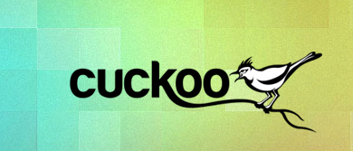

Pendahuluan Cuckoo
==================

Apa itu Cuckoo??
^^^^^^^^^^^^^^^^

Cuckoo Sandbox merupakan software yang bersifat open source yang digunakan dalam melakukan analisis malware secara otomatis. Cuckoo Sandbox merupakan salah satu dari sekian banyak tool untuk melakukan analisis malware, diketahui bahwa Cuckoo Sandbox masuk dalam kategori tool analisis malware dinamis. Metode analisis malware dinamis dilakukan dengan cara menjalankan malware pada komputer disertai mempelajari perilaku malware tersebut di komputer. Bahwa malware yang bersangkutan akan menginfeksi komputer dengan dampak diantaranya memodifikasi sistem, menjalankan layanan tertentu, menghapus direktori, dan lain-lain. Oleh karena itu penggunaan Cuckoo Sandbox sebagai tool analisis malware dapat dijadikan sebagai solusi untuk mengurangi dampak resiko kerusakan pada komputer akibat dari malware, dengan cara melakukan isolasi malware tersebut dari komputer. Dilanjutkan dengan memberikan laporan sebagai hasil dari perilaku malware pada komputer. Berikut hasil analisis dari Cuckoo Sandbox, diantaranya :
a.File yang dibuat, dihapus, dan diunduh akibat aktivitas malware 
b.API calls yang ditimbulkan oleh malware
c.Aktivitas malware di memori atau memory dumps
d.Jejak lalu lintas jaringan dalam format PCAP
e.Screenshot yang diambil selama eksekusi malware

Awal dibuatnya Cuckoo Malware Analysis Sandbox
^^^^^^^^^^^^^^^^^^^^^^^^^^^^^^^^^^^^^^^^^^^^^^

Pada tahun 2010, Claudio Guarnieri merancang dan mengembangkan proyek dari Google Summer of Code berupa Cuckoo Sandbox dalam Honeynet Project. Kemudian proyek yang dirancang tersebut baru didistribusikan ke publik pada tanggal 5 februari 2011 dengan versi beta sebagai rilisan pertama. Selanjutnya dengan terpilihnya kembali Cuckoo Sandbox pada bulan maret 2011 sebagai proyek yang didukung oleh perusahaan sebelumnya, menjadikan Dario Fernandes tertarik bergabung untuk mengembangkannya. Seiring berjalannya waktu kemudian Cuckoo merilis ke publik versi 0.2 pada tanggal 2 november 2011. Melihat prospek yang bagus, maka Alessandro Tanasi juga ikut bergabung sebagai tim yang memperluas fungsionalitas pemrosesan dan pelaporan Cuckoo. Sehingga pada desember 2011 kembali dirilis lagi Cuckoo v0.3 dan menjadi populer dikalangan publik. 
Selanjutnya Cuckoo Sandbox membuat malwr.com berupa layanan yang tersedia bagi publik dengan disertai interface lengkap melalui Cuckoo Sandbox Instance untuk keperluan analisis malware. Karena hal tersebut, Cuckoo Sandbox memenangkan putaran pertama program Magnificent7 yang diselenggarakan oleh Rapid7 pada bulan maret 2011. 
Pada tahun 2012, Jurriaan Bremer bergabung dalam tim peningkatan kualitas analisis yang fokus pada pengembangan dan perbaikan komponen analisis pada Windows. Diketahui bahwa Cuckoo Sandbox terus berkembang dan merilis versi 0.4 pada tanggal 24 juli 2012. Lanjut dirilis versi 0.5 “To The End Of The World” lagi pada tanggal 20 desember 2012.
Kemudian tahun 2013 diluncurkan kembali versi kedua dari Malwr.com dan setelah itu disusul Cuckoo Sandbox pada tanggal 15 april 2013. Di tahun yang sama Claudio Guarnieri, Jurrian Bremer, dan Mark Schloesser mempersembahkan "Mo' malware mo' problems - Cuckoo to the rescue!" di Black Hat Las Vegas tepatnya tanggal 1 Agustus 2013.
Berikutnya pada tanggal 9 januari 2014, Cuckoo Sandbox versi 1.0 dirilis. Pada bulan maret 2014 Cuckoo Foundation lahir sebagai organisasi nirlaba yang didedikasikan untuk pertumbuhan Cuckoo Sandbox. Pada tanggal 7 April 2014, Cuckoo Sandbox versi 1.1 dirilis. Akibat kritik kerentanan dari Robert Michel, maka pada tanggal 7 oktober 2014 Cuckoo Sandbox versi 1.1.1 dirilis sebagai perbaikan versi sebelumnya. 
Pada tanggal 4 maret 2015, Cuckoo Sandbox versi 1.2 dirilis dengan menyediakan layanan tampilan yang beragam mengenai kegunaan Cuckoo Sandbox. Selama tahun 2015 Cuckoo Sandbox memulai pengembangan analisis malware pada Mac OS X sebagai proyek Google Summer of Code dalam Honeynet Project. Selanjutnya Dmitry Rodionov ikut mengembangkan alat analisis untuk Mac OS X.
Pada 21 Februari 2016 versi 2.0 Release Candidate 1 dirilis. Versi ini diklaim sebagai versi proyek yang lebih baik untuk penggunaan sehari-hari pada Cuckoo Sandbox. Masuk tahun 2017 dirilis versi 2.0.0 dalam betuk paket dengan tujuan agar lebih meyederhanakan penggunaan, pemeliharaan, kemampuan pembaruan, stabilitas pada Cuckoo. Dan terakhir yang paling terbaru dibuatlah website dan versi Cuckoo 2.0.4, dengan menampilkan banyak perbaikan mengenai ekstraksi konfigurasi malware.

Penggunaan Cuckoo
^^^^^^^^^^^^^^^^^
Cuckoo Sandbox didesain untuk digunakan baik sebagai aplikasi atau bisa juga sebagai integrasi dalam rangka kerja atau proyek yang lebih besar, dikarenakan desainnya yang modular. Selanjutnya Cuckoo Sandbox dapat digunakan untuk menganalisis sebagai berikut :
a.File DLL

b.Dokumen PDF

c.Dokumen Microsoft Office

d.URL dan file HTML

e.Skrip PHP

f.File ZIP

g.Java JAR

F  Python FIle

